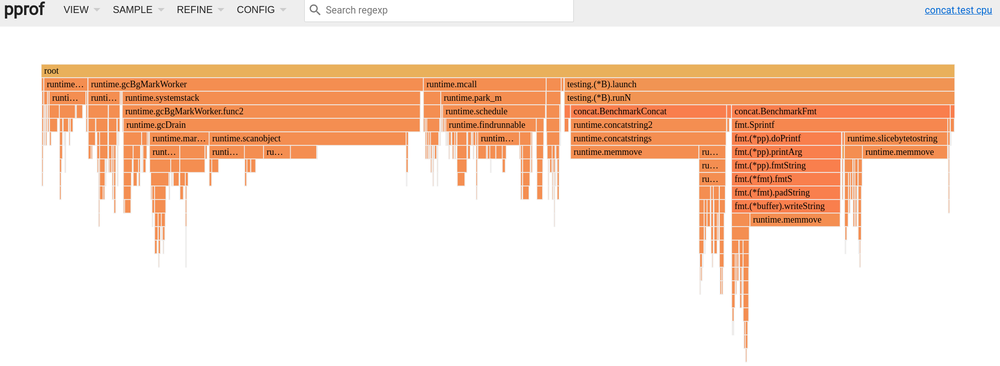

# Go Benchmarks

This is a collection of multiple benchmarks. Some of them are just copied from other projects or from the internet.

## Profiling

Predefined profiles provided by the [runtime/pprof](https://go.dev/pkg/runtime/pprof) package:

  -  **cpu**: CPU profile determines where a program spends its time while actively consuming CPU cycles (as opposed to while sleeping or waiting for I/O).
  -  **heap**: Heap profile reports memory allocation samples; used to monitor current and historical memory usage, and to check for memory leaks.
  -  **threadcreate**: Thread creation profile reports the sections of the program that lead the creation of new OS threads.
  -  **goroutine**: Goroutine profile reports the stack traces of all current goroutines.
  -  **block**: Block profile shows where goroutines block waiting on synchronization primitives (including timer channels). Block profile is not enabled by default; use runtime.SetBlockProfileRate to enable it.
  -  **mutex**: Mutex profile reports the lock contentions. When you think your CPU is not fully utilized due to a mutex contention, use this profile. Mutex profile is not enabled by default, see runtime.SetMutexProfileFraction to enable it.

## Go help

Before starting to write Go tests, make sure to read the [go.dev](https://pkg.go.dev/testing) documentation and the go help pages:

```bash
go help test
go help testflag
go help testfunc
go tool pprof --help
```

## Go test flags

There are multiple flags provided by the go test command. This project documentation will shortly cover few different flags:

```bash
  -test.bench regexp
        run only benchmarks matching regexp
  -test.benchmem
        print memory allocations for benchmarks
  -test.benchtime d
        run each benchmark for duration d (default 1s)
  -test.blockprofile file
        write a goroutine blocking profile to file
  -test.blockprofilerate rate
        set blocking profile rate (see runtime.SetBlockProfileRate) (default 1)
  -test.count n
        run tests and benchmarks n times (default 1)
  -test.coverprofile file
        write a coverage profile to file
  -test.cpu list
        comma-separated list of cpu counts to run each test with
  -test.cpuprofile file
        write a cpu profile to file
  -test.failfast
        do not start new tests after the first test failure
  -test.list regexp
        list tests, examples, and benchmarks matching regexp then exit
  -test.memprofile file
        write an allocation profile to file
  -test.memprofilerate rate
        set memory allocation profiling rate (see runtime.MemProfileRate)
  -test.mutexprofile string
        write a mutex contention profile to the named file after execution
  -test.mutexprofilefraction int
        if >= 0, calls runtime.SetMutexProfileFraction() (default 1)
  -test.outputdir dir
        write profiles to dir
  -test.paniconexit0
        panic on call to os.Exit(0)
  -test.parallel n
        run at most n tests in parallel (default 24)
  -test.run regexp
        run only tests and examples matching regexp
  -test.short
        run smaller test suite to save time
  -test.shuffle string
        randomize the execution order of tests and benchmarks (default "off")
  -test.testlogfile file
        write test action log to file (for use only by cmd/go)
  -test.timeout d
        panic test binary after duration d (default 0, timeout disabled)
  -test.trace file
        write an execution trace to file
  -test.v
        verbose: print additional output
```

## Standard library

The testing package provides support for running unittests and also benchmarking. To write a new test case, create a file whose name ends with _test.go.

With **go test** is possible to run all tests and benchmarks a single command. To profile the application, a specific package must be provided. Following command is going to display all tests and benchmarks to the standard output:

```bash
go test -bench=. -benchtime 1s -benchmem ./...
```

In order to exclude all tests and run only the benchmarks, provide the **run** flag with a non matching regexp:

```bash
go test -bench=. -benchtime 10s -benchmem -run=^$ ./...
```

**Benchmarking of a concatenation of strings:**

```bash
# Concat Strings
BenchmarkConcat-24               1000000             67038 ns/op          503995 B/op          1 allocs/op
BenchmarkFmt-24                   940023            131664 ns/op          946526 B/op          4 allocs/op
BenchmarkBuffer-24              176537760                6.773 ns/op           5 B/op          0 allocs/op
BenchmarkCopy-24                345607824                3.212 ns/op           2 B/op          0 allocs/op
BenchmarkStringBuilder-24       458440635                2.534 ns/op           6 B/op          0 allocs/op
```

Go also provides a benchstat tool, which is very useful to compare different benchmarks to ensure the perfomance hasn't been degraded. Install the benchstat tool with go install command:

```bash
go install golang.org/x/perf/cmd/benchstat@latest
```

Let's run the same benchmarking twice and compare its results, then save the output to a file and use the **count** flag to rerun the benchmarks couple of times:

```bash
go test -bench=. -benchtime 5s -count 5 -benchmem ./concat > bench1.log
```

In this case, the function inside the BenchmarkConcat is going to be replaced with the BenchmarkBuffer to show some nice statistics. Once again after the changes:

```bash
$ go test -bench=. -benchtime 5s -count 5 -benchmem ./concat | tee bench2.log
BenchmarkConcat-24              991294297                5.066 ns/op           4 B/op          0 allocs/op
BenchmarkConcat-24              1000000000               5.090 ns/op           4 B/op          0 allocs/op
BenchmarkConcat-24              1000000000               5.164 ns/op           4 B/op          0 allocs/op
BenchmarkConcat-24              1000000000               5.018 ns/op           4 B/op          0 allocs/op
BenchmarkConcat-24              1000000000               5.027 ns/op           4 B/op          0 allocs/op
... # removed
PASS
ok      github.com/rchicoli/go-benchmarks/concat        122.664s
```

Now just compare the results with benchstat tool:

```bash
benchstat bench1.log bench2.log
```

It is amazing how easy and useful this can be to optize any part of the code. In the example above, it is reasonable notice the costs of using a string concatenation, lets dive into the package and profile the used functions.

## How to profile

Generate the cpu and memory profiles by providing the package folder:

```bash
go test -bench=. -benchtime 10s -benchmem -cpuprofile cpu.prof -memprofile mem.prof ./concat
```

It is possible to use the go tools command or also to install the pprof package:

```bash
go install github.com/google/pprof@latest
```

### Interative Shell

Load the memory profile file with the pprof command:

```bash
$ go tool pprof mem.prof
File: concat.test
Type: alloc_space
Time: Feb 6, 2022 at 9:37am (CET)
Entering interactive mode (type "help" for commands, "o" for options)
(pprof)
```

Use the **top** command inside the interactive shell to output the top entries in text form

```bash
(pprof) top 20
Showing nodes accounting for 1143.67GB, 99.49% of 1149.58GB total
Dropped 58 nodes (cum <= 5.75GB)
      flat  flat%   sum%        cum   cum%
  469.01GB 40.80% 40.80%   469.01GB 40.80%  github.com/rchicoli/go-benchmarks/concat.BenchmarkConcat
  338.62GB 29.46% 70.25%   675.08GB 58.72%  fmt.Sprintf
  336.02GB 29.23% 99.48%   336.02GB 29.23%  fmt.(*buffer).writeString (inline)
    0.02GB 0.0014% 99.49%   675.10GB 58.73%  github.com/rchicoli/go-benchmarks/concat.BenchmarkFmt
         0     0% 99.49%   336.02GB 29.23%  fmt.(*fmt).fmtS
         0     0% 99.49%   336.02GB 29.23%  fmt.(*fmt).padString
         0     0% 99.49%   336.02GB 29.23%  fmt.(*pp).doPrintf
         0     0% 99.49%   336.02GB 29.23%  fmt.(*pp).fmtString
         0     0% 99.49%   336.02GB 29.23%  fmt.(*pp).printArg
         0     0% 99.49%  1149.57GB   100%  testing.(*B).launch
         0     0% 99.49%  1149.57GB   100%  testing.(*B).runN
```

If nodes are dropped, the nodefraction option can be used to display all nodes. This can activated either inside the shell or with the cli command:

```bash
# display all nodes
$ pprof -nodefraction=0 mem.prof

# enable or disable options inside the shell
(pprof) nodefraction=0
```

The **list** command outputs the source of functions matching the regexp

```bash
(pprof) list concat.BenchmarkConcat
Total: 1.12TB
ROUTINE ======================== github.com/rchicoli/go-benchmarks/concat.BenchmarkConcat in /home/rfxchlx/Git/github.com/rchicoli/go-benchmarks/concat/strings_test.go
  469.01GB   469.01GB (flat, cum) 40.80% of Total
         .          .     17:
         .          .     18:func BenchmarkConcat(b *testing.B) {
         .          .     19:   // b.Skip()
         .          .     20:   var str string
         .          .     21:   for n := 0; n < b.N; n++ {
  469.01GB   469.01GB     22:           str += "x"
         .          .     23:   }
         .          .     24:   // b.StopTimer()
         .          .     25:
         .     1.13MB     26:   if s := strings.Repeat("x", b.N); str != s {
         .          .     27:           b.Errorf("unexpected result; got=%s, want=%s", str, s)
         .          .     28:   }
         .          .     29:}
         .          .     30:
         .          .     31:func BenchmarkFmt(b *testing.B) {
```

The **tree** command can be also useful to see the code dependency calls of a function

```bash
(pprof) tree concat.BenchmarkConcat
Active filters:
   focus=concat.BenchmarkConcat
Showing nodes accounting for 480268.80MB, 40.80% of 1177169.79MB total
----------------------------------------------------------+-------------
      flat  flat%   sum%        cum   cum%   calls calls% + context
----------------------------------------------------------+-------------
                                       480268.80MB   100% |   testing.(*B).runN
480267.67MB 40.80% 40.80% 480268.80MB 40.80%                | github.com/rchicoli/go-benchmarks/concat.BenchmarkConcat
----------------------------------------------------------+-------------
    1.13MB 9.6e-05% 40.80%     1.13MB 9.6e-05%                | strings.(*Builder).grow
----------------------------------------------------------+-------------
         0     0% 40.80%     1.13MB 9.6e-05%                | strings.(*Builder).Grow
----------------------------------------------------------+-------------
         0     0% 40.80%     1.13MB 9.6e-05%                | strings.Repeat
----------------------------------------------------------+-------------
         0     0% 40.80% 480268.80MB 40.80%                | testing.(*B).launch
                                       480268.80MB   100% |   testing.(*B).runN
----------------------------------------------------------+-------------
                                       480268.80MB   100% |   testing.(*B).launch
         0     0% 40.80% 480268.80MB 40.80%                | testing.(*B).runN
                                       480268.80MB   100% |   github.com/rchicoli/go-benchmarks/concat.BenchmarkConcat
----------------------------------------------------------+-------------
```


### Interative web interface

```bash
go tool pprof -http=":8000" -nodefraction=0 cpu.prof
```



## Sources

  - https://github.com/Tkanos/strings-vs-bytes/blob/master/bench_test.go
  - https://www.soroushjp.com/2015/01/27/beautifully-simple-benchmarking-with-go/
  - https://stackoverflow.com/questions/1760757/how-to-efficiently-concatenate-strings-in-go
  - https://hackernoon.com/go-the-complete-guide-to-profiling-your-code-h51r3waz
  - https://pkg.go.dev/testing